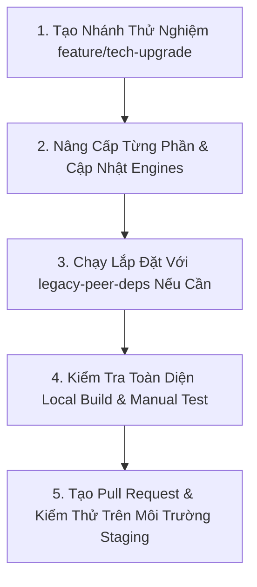

# 🛡️ BÁO CÁO ĐÁNH GIÁ RỦI RO NÂNG CẤP CÔNG NGHỆ (TECH UPGRADE RISK GUIDE)
### Dự án: Whip (whip-api & whip-app)

Báo cáo này phân tích và đánh giá mức độ rủi ro chi tiết khi nâng cấp phiên bản cho các công nghệ cốt lõi của cả hệ thống backend (`whip-api`) và frontend (`whip-app`).

---

## 📊 1. MA TRẬN ĐÁNH GIÁ RỦI RO (RISK MATRIX)

| Công nghệ | Phiên bản hiện tại | Phiên bản đề xuất | Mức độ rủi ro | Ảnh hưởng tính năng |
| :--- | :--- | :--- | :--- | :--- |
| **React** | `^18.2.0` | `^19.0.0` | 🔴 **Rất Cao (Critical)** | Hệ thống Drag-and-Drop, các Popover MUI, React Hook Form |
| **Express.js** | `^4.18.2` | `^5.0.0` | 🟡 **Trung Bình (Medium)** | Middleware xử lý lỗi (Error Handler), Route Path |
| **Vite** | `4.3.2` | `^5.4.11` | 🟡 **Trung Bình (Medium)** | ✅ Đã cập nhật lên `^5.4.11` (Tương thích Node 20) |
| **MUI (Material UI)** | `^5.18.0` | `^6.x` | 🟡 **Trung Bình (Medium)** | Theme cấu hình, CSS injection, các components UI |
| **@dnd-kit** | `@dnd-kit/core: ^6.0.8` | Phiên bản mới nhất | 🔴 **Cao (High)** | Kéo thả Columns và Cards (Core UI của board) |
| **Socket.io & Client** | `^4.7.4` | `^4.8.3` | 🟢 **Thấp (Low)** | ✅ Đã cập nhật lên `^4.8.3` (Cả API và App) |
| **Node.js** | `>=18.x` | `Node 20 LTS` | 🟢 **Thấp (Low)** | ✅ Đã cập nhật lên `Node 20` (Docker & Engines) |
| **MongoDB Driver** | `^7.0.0` | `^7.3.0` | 🟢 **Thấp (Low)** | ✅ Đã cập nhật lên `^7.3.0` |

---

## 🔍 2. PHÂN TÍCH CHI TIẾT & BIỆN PHÁP GIẢM THIỂU RỦI RO

### 🔴 React 18.2.0 ➔ 19.0.0
> **Rủi ro:** 🔴 RẤT CAO | **Độ ưu tiên nâng cấp:** Thấp (Nên đợi thư viện bên thứ 3 tương thích hoàn toàn)

* **Rủi ro tiềm ẩn:**
  1. **Tương thích thư viện bên thứ ba:** Nhiều thư viện cốt lõi như `@dnd-kit`, `@uiw/react-md-editor`, và `material-ui-confirm` chưa tương thích 100% với React 19. Khi cài đặt sẽ xảy ra lỗi `peer dependencies conflict` (phải dùng `--legacy-peer-deps`).
  2. **Thay đổi API Ref:** React 19 thay thế `forwardRef` bằng việc truyền `ref` như một prop thông thường. Mặc dù có cơ chế tương thích ngược nhưng có thể gây cảnh báo hoặc lỗi ở một số UI components tự viết.
  3. **Loại bỏ defaultProps:** Sẽ không còn hỗ trợ `defaultProps` cho Function Components, bắt buộc phải đổi sang dùng mặc định của ES6 (`const Component = ({ prop = defaultValue }) => ...`).
* **Biện pháp giảm thiểu:**
  - **Không** nâng cấp trực tiếp trên nhánh `master`. Tạo một nhánh riêng `feature/react-19-migration` để test độc lập.
  - Kiểm tra kỹ tài liệu của `@dnd-kit` và `@mui/material` để xem các bản vá hỗ trợ React 19 trước khi thực hiện.

---

### 🔴 @dnd-kit (Core & Sortable)
> **Rủi ro:** 🔴 CAO | **Độ ưu tiên nâng cấp:** Rất thấp (Chỉ nâng cấp khi có lỗi bảo mật hoặc nâng cấp React)

* **Rủi ro tiềm ẩn:**
  - `@dnd-kit` là thư viện quản lý kéo thả (Drag and Drop) cho các cột (Columns) và thẻ (Cards) trên bảng công việc (Board) - đây là tính năng quan trọng nhất của **Whip App**.
  - Việc nâng cấp phiên bản của `@dnd-kit` hoặc React đi kèm có khả năng rất cao làm gián đoạn tính năng kéo thả, gây hiện tượng: lệch tọa độ khi kéo, mất hiệu ứng di chuyển (transition), hoặc crash ứng dụng khi đang drop phần tử do xung đột trạng thái (state conflict).
* **Biện pháp giảm thiểu:**
  - Viết Unit Test/E2E Test tự động cho luồng kéo thả card và column.
  - Khi nâng cấp, phải test thủ công kỹ càng trên nhiều trình duyệt khác nhau (Chrome, Safari, Firefox) và cả trên thiết bị di động.

---

### 🟡 Express 4.18.2 ➔ 5.0.0
> **Rủi ro:** 🟡 TRUNG BÌNH | **Độ ưu tiên nâng cấp:** Trung bình

* **Rủi ro tiềm ẩn:**
  1. **Xử lý lỗi Promise tự động:** Express 5 hiện đã tự động bắt các lỗi phát sinh từ các route handler bất đồng bộ (async) và chuyển tiếp tới middleware xử lý lỗi cuối cùng mà không cần gọi `next(err)`. Project hiện tại đang dùng các wrapper hoặc middleware tùy biến, điều này có thể gây ra hiện tượng lỗi bị bắt 2 lần (double catch) hoặc log lỗi không đúng định dạng.
  2. **Thay đổi cơ chế so khớp Route:** Express 5 thay đổi thư viện `path-to-regexp`. Một số ký tự wildcard (`*`, `?`) trong route path sẽ hoạt động khác biệt, có thể làm hỏng các router endpoint hiện tại.
* **Biện pháp giảm thiểu:**
  - Rà soát lại toàn bộ file `src/routes/v1/*.js` và middleware xử lý lỗi tổng `errorHandlingMiddleware.js` để điều chỉnh cấu trúc bắt lỗi async.

---

### 🟡 Vite 4.3.2 ➔ 5.x / 6.x
> **Rủi ro:** 🟡 TRUNG BÌNH | **Độ ưu tiên nâng cấp:** Cao (Để cải thiện tốc độ Build và Dev Server)

* **Rủi ro tiềm ẩn:**
  1. **Yêu cầu phiên bản Node.js:** Vite 5 yêu cầu Node.js v18+, Vite 6 yêu cầu Node.js v20+. Nếu nâng cấp Vite, bắt buộc phải cập nhật Node.js trên cả local và môi trường chạy trên VPS/Vercel.
  2. **Thay đổi API cấu hình:** Cách xử lý import các file SVG (qua `vite-plugin-svgr`) hoặc cấu hình CSS biến đổi trong `vite.config.js` có thay đổi nhẹ.
* **Biện pháp giảm thiểu:**
  - Đồng bộ nâng cấp Node.js lên phiên bản LTS (`Node 20` hoặc `Node 22`) trong file `package.json` mục `engines` và Dockerfile trước khi nâng cấp Vite.
  - Xem kỹ tài liệu migration của `vite-plugin-svgr` để sửa cách import SVG.

---

### 🟡 MUI (Material UI) v5 ➔ v6
> **Rủi ro:** 🟡 TRUNG BÌNH | **Độ ưu tiên nâng cấp:** Trung bình

* **Rủi ro tiềm ẩn:**
  1. **CSS Injection & Emotion:** MUI v6 thay đổi nhẹ cách kết hợp với Emotion, đặc biệt là cách render CSS phía server (SSR) hoặc các Popover, Modal. Có thể xảy ra hiện tượng "flash" giao diện không style khi tải trang.
  2. **Cấu hình Theme:** Các thuộc tính tùy biến trong file `theme.js` cần được ánh xạ lại theo cấu trúc cấu hình mới của MUI v6.
* **Biện pháp giảm thiểu:**
  - Chạy ứng dụng ở chế độ production build cục bộ (`npm run build && npm run preview`) để kiểm tra xem có bị vỡ giao diện do tối ưu hóa CSS hay không.

---

### 🟢 Node.js 18 ➔ 20 LTS / 22 LTS
> **Rủi ro:** 🟢 THẤP | **Độ ưu tiên nâng cấp:** Rất Cao (Nên thực hiện sớm)

* **Rủi ro tiềm ẩn:**
  - Không có rủi ro lớn đối với mã nguồn javascript thuần ES6 hiện tại.
  - Cần đảm bảo các base image trong `Dockerfile` (`node:18-alpine` chuyển thành `node:20-alpine`) được đồng bộ hóa.
* **Biện pháp giảm thiểu:**
  - Thay đổi trường `engines` trong `package.json` của cả `whip-api` và `whip-app` để ép buộc sử dụng phiên bản mới.
  - Cập nhật biến môi trường chạy trên Render/Vercel và thay thế base image trong Dockerfile của backend.

---

## 🛠️ 3. QUY TRÌNH NÂNG CẤP AN TOÀN (SAFE UPGRADE WORKFLOW)

Để đảm bảo dự án luôn hoạt động ổn định (Zero-Downtime) trong suốt quá trình nâng cấp, hãy tuân thủ nghiêm ngặt 5 bước sau:



### Bước 1: Chuẩn bị nhánh
Không bao giờ được cài đặt trực tiếp lên các nhánh chính.
```bash
git checkout -b feature/upgrade-dependencies
```

### Bước 2: Nâng cấp từng gói đơn lẻ
Tránh nâng cấp hàng loạt (ví dụ: chạy `npm update` vô tội vạ). Hãy nâng cấp từng thư viện để dễ dàng khoanh vùng lỗi nếu xảy ra crash.
```bash
# Ví dụ: Chỉ nâng cấp Node version trong config & Docker trước
# Sau đó nâng cấp Vite
npm install --save-dev vite@latest
```

### Bước 3: Kiểm tra Build ở Production Mode cục bộ
Một lỗi phổ biến là code chạy bình thường ở môi trường Dev (`npm run dev`) nhưng lại bị crash khi đóng gói ra bản Production (`npm run build`).
```bash
# Chạy build thử nghiệm
npm run build

# Chạy bản build thử nghiệm cục bộ để test
npm run preview
```

### Bước 4: Danh sách kiểm thử thủ công (Manual Test Checklist) bắt buộc:
- [ ] Luồng đăng nhập / đăng ký / refresh token.
- [ ] Tính năng kéo thả Column trên Board.
- [ ] Tính năng kéo thả Card từ Column này sang Column khác.
- [ ] Mở Card chi tiết, tạo Checklist, thêm Comment, và Upload tài liệu đính kèm (Attachment).
- [ ] Kết nối realtime qua Web Socket (Socket.io) khi có 2 tab trình duyệt cùng mở một Board để kiểm tra đồng bộ.

---

## 📅 4. KHUYẾN NGHỊ LỘ TRÌNH (ROADMAP)

1. **Giai đoạn 1 (Ngay lập tức):** Nâng cấp Node.js lên `v20 LTS` cho cả backend và frontend. Cập nhật `Dockerfile` sang `node:20-alpine`. (Rủi ro: Rất thấp).
2. **Giai đoạn 2 (Tuần tiếp theo):** Nâng cấp Vite lên `v5.x` và cấu hình liên quan để tối ưu hóa thời gian build frontend. (Rủi ro: Thấp).
3. **Giai đoạn 3 (Sau khi dự án ổn định tính năng):** Xem xét nâng cấp MUI lên `v6` và Express lên `v5` trên một nhánh phát triển biệt lập.
4. **Giai đoạn 4 (Chờ đợi thêm):** Chỉ nâng cấp React lên `v19` khi `@dnd-kit` và các plugin khác ra mắt bản cập nhật hỗ trợ chính thức hoàn toàn.
